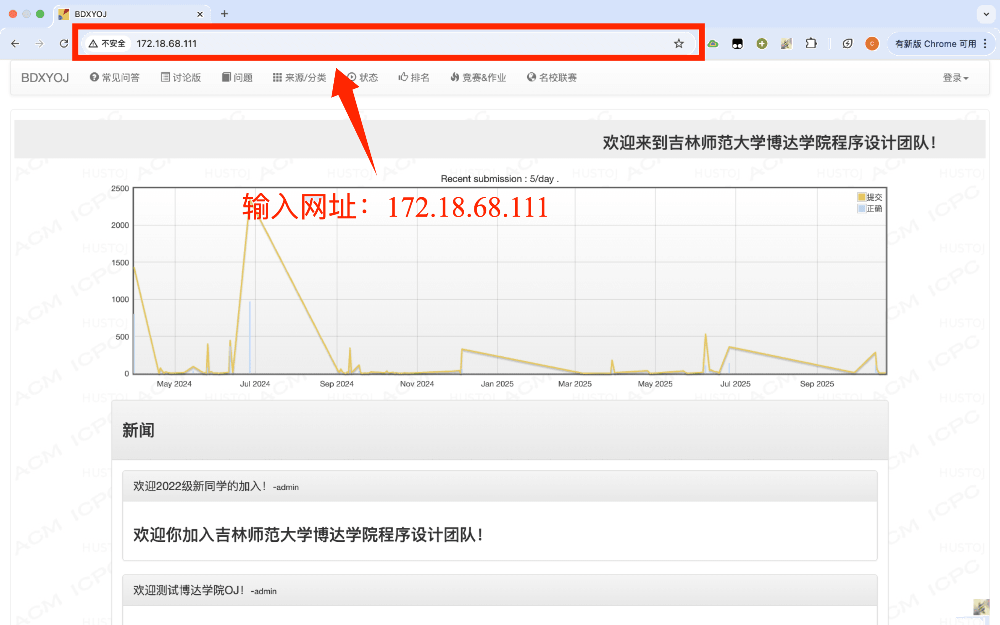
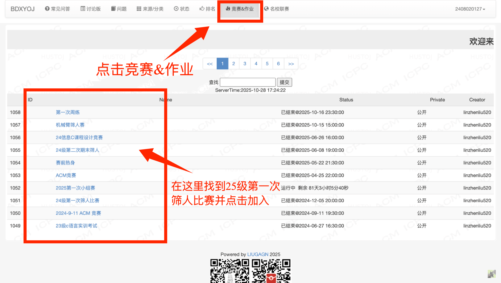

# 博达OJ使用教程

OJ网址：172.18.68.111

### 第一步：打开浏览器并在上方地址栏输入：172.18.68.111   跳转到OJ网站

### 第二步：点击右上角登录按钮选择注册

### 第三步：用户名输入自己的学号，昵称输入自己的姓名，完成注册。

### 第四步：登录

### 第五步：点击上方竞赛&作业，找到25级第一次筛人前热身并进入

### 如何提交

在codeblocks内编辑完代码并自行测试无误后，在题目页面点击提交，选择对应的语言，粘贴全部代码并提交即可。如果运行有误请仔细检查代码是否有误
